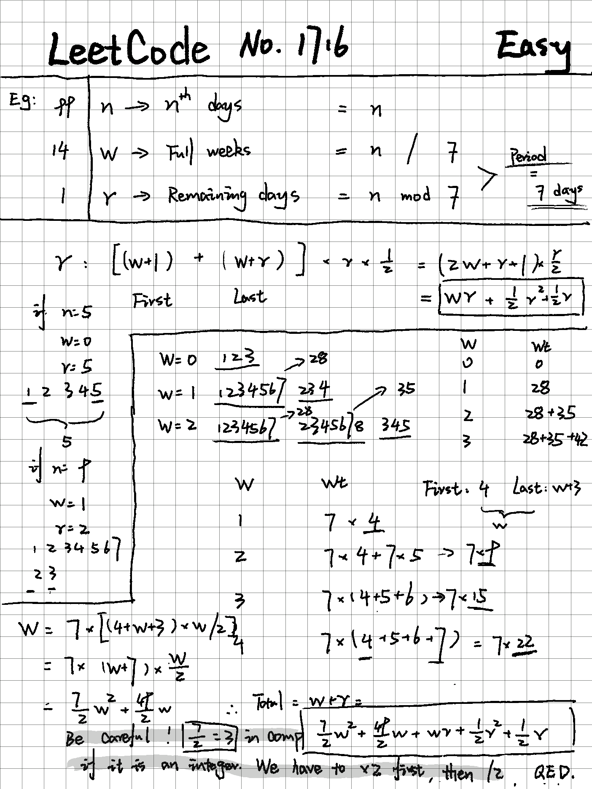

# [1716. Calculate Money in LeetCode Bank](https://leetcode.com/problems/calculate-money-in-leetcode-bank/)

## 1. Description

Hercy wants to save money for his first car. He puts money in the Leetcode bank **every day**.

He starts by putting in `$1` on Monday, the first day. Every day from Tuesday to Sunday, he will put in `$1` more than the day before. On every subsequent Monday, he will put in `$1` more than the **previous Monday**.

Given `n`, return *the total amount of money he will have in the Leetcode bank at the end of the $n^{\text{th}}$ day*.


**Example 1:**

```
Input: n = 4
Output: 10
Explanation: After the 4th day, the total is 1 + 2 + 3 + 4 = 10.
```

**Example 2:**

```
Input: n = 10
Output: 37
Explanation: After the 10th day, the total is (1 + 2 + 3 + 4 + 5 + 6 + 7) + (2 + 3 + 4) = 37. Notice that on the 2nd Monday, Hercy only puts in $2.
```

**Example 3:**

```
Input: n = 20
Output: 96
Explanation: After the 20th day, the total is (1 + 2 + 3 + 4 + 5 + 6 + 7) + (2 + 3 + 4 + 5 + 6 + 7 + 8) + (3 + 4 + 5 + 6 + 7 + 8) = 96.
```

**Constraints:**

- $1 \leq n \leq 1000$

## 2. Solutions

### Solution 1: `Language: C` Mathematics

Refer to the hand-writing picture below.



- Tuesday, 16 March, 2021
- Time Complexity: $O(1)$
- Space Complexity: $O(1)$
- *Runtime: 0 ms, faster than 100.00% of C online submissions for Calculate Money in Leetcode Bank.*
- *Memory Usage: 5.5 MB, less than 55.63% of C online submissions for Calculate Money in Leetcode Bank.*

```C
int totalMoney(int n) {
    // w is the number of full-week past.
    int w = n / 7;
    // r is the number of days which could not be calculated as a full week.
    int r = n % 7;
    // Careful! Because of the integer data type, 49/2 is equal to 24 rather
    // than 24.5, so we need to multiple it by 2 and then divided it by 2.
    return (2 * w * r + r * r + r + 7 * w * w + 49 * w) / 2;
}
```
