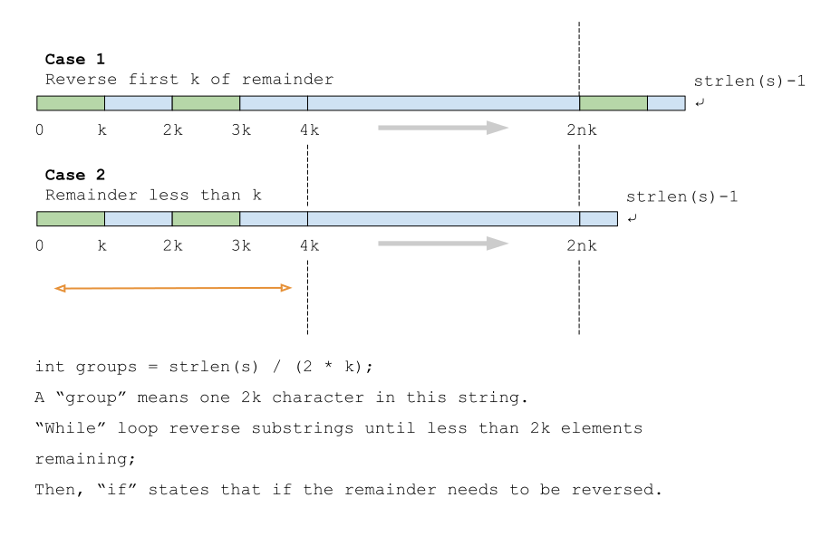

# [541. Reverse String II](https://leetcode.com/problems/reverse-string-ii)

## 1. Description

Given a string and an integer k, you need to reverse the first k characters for every 2k characters counting from the start of the string. If there are less than k characters left, reverse all of them. If there are less than 2k but greater than or equal to k characters, then reverse the first k characters and left the other as original.

**Example:**

```
Input: s = "abcdefg", k = 2
Output: "bacdfeg"
```

**Restrictions:**

1. The string consists of lower English letters only.
2. Length of the given string and k will in the range [1, 10000]

## 2. Solutions

> Tuesday, 25 August, 2020
> Time Complexity: $O(kn)$
> Space Complexity: $O(1)$



```C
void reverseString(char *s, int head, int tail) {
    while (head < tail) {
        // Swapping two characters.
        int temp = s[head];
        s[head] = s[tail];
        s[tail] = temp;
        head++;
        tail--;
    }
}

char *reverseStr(char *s, int k) {
    // See the diagram for help.
    int groups = strlen(s) / (2 * k);
    int n = 0;
    // Reverse substrings until the remainder less than 2k;
    while (n < groups) {
        reverseString(s, 2 * k * n, 2 * k * n + k - 1);
        n++;
    }
    // k > remainder;
    if (strlen(s) % (2 * k) < k) {
        reverseString(s, 2 * k * n, strlen(s) - 1);
    // 2k > remainder > k.
    } else {
        reverseString(s, 2 * k * n, 2 * k * n + k - 1);
    }
    return s;
}
```

## 3. Error Log and Notes

- When I tried to determine the condition `if (n == groups)`, I used `=` which could lead to an always-true sentence.
- Complexity: $O(n)$ or $O(n^{2})$? (I think it should be $O(n)$, but how about `reverseString` function?)
